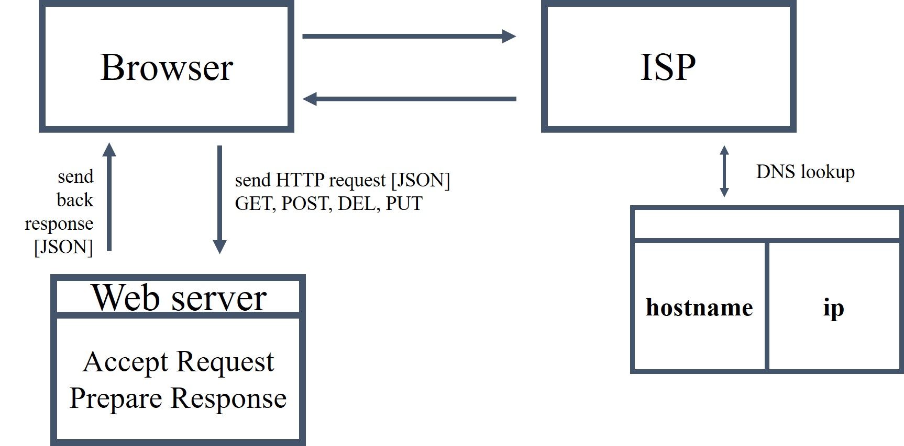

# Week1

## 1. Web Cycle

## 2. Reponse, Request

|           | Reponse                |  Request                        |
|-----------|------------------------|---------------------------------|
|sending    | message body[JSON]     |message body[JSON], status code  |

* *some status code*
  - *200 : ok*
  - *404 : server not found error*

## 3. Method
---
* GET
  - get resource from server
* POST
  - send information to server, and expecting response based on information
* PUT
  - update whatever we create
* DELETE
  - delete certain resource from server
